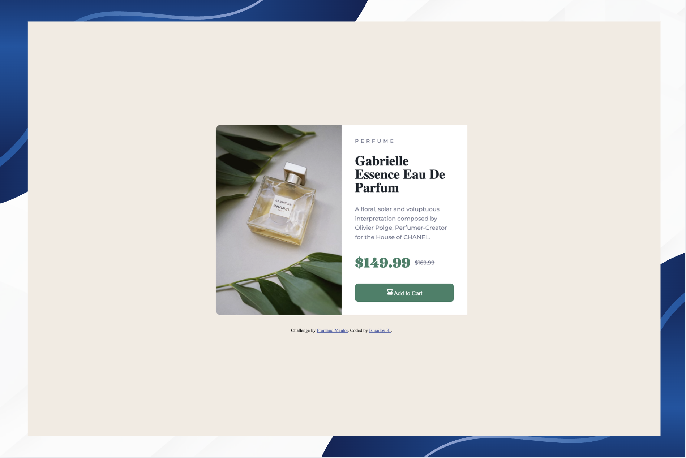

# Frontend Mentor - Product preview card component solution
### Screenshot



This is my solution to the [Product preview card component challenge on Frontend Mentor](https://www.frontendmentor.io/challenges/product-preview-card-component-GO7UmttRfa).

## Table of contents
  - [Screenshot](#screenshot)

- [Overview](#overview)
  - [The challenge](#the-challenge)
  - [Links](#links)
- [My process](#my-process)
  - [Built with](#built-with)
  - [What I learned](#what-i-learned)
  - [Continued development](#continued-development)
  - [Useful resources](#useful-resources)
  - [AI Collaboration](#ai-collaboration)
- [Author](#author)

## Overview

### The challenge

Users should be able to:

- View the optimal layout depending on their device's screen size
- See hover and focus states for interactive elements

### Links

- Solution URL: [Add solution URL here](https://your-solution-url.com)
- Live Site URL: [Add live site URL here](https://your-live-site-url.com)

## My process

### Built with

- Semantic HTML5 markup
- Flexbox
- Mobile-first responsive design
- Google Fonts (Fraunces + Montserrat)

### What I learned

**1. `align-items: stretch` for equal height columns**

When two elements sit side by side in a flex container, `stretch` makes them the same height automatically — no need for a fixed `height` value.

```css
article {
    display: flex;
    align-items: stretch;
}
```

**2. CSS Reset should always come first**

The `*` reset block must be placed at the very top of your CSS file, before any other styles:

```css
* {
    padding: 0;
    margin: 0;
    box-sizing: border-box;
}
```

**3. Correct heading hierarchy**

`h1` should always be the first and most important heading on the page. Labels like "PERFUME" that are not true headings should use a `<p>` tag instead:

```html
<p class="product-type">Perfume</p>
<h1 class="product-name">Gabrielle Essence Eau De Parfum</h1>
```

**4. Font family fallbacks**

Always provide a fallback font after your custom font. Also, font weight is set separately — never write "Font Name Bold":

```css
/* Wrong */
font-family: "Fraunces Bold";

/* Correct */
font-family: "Fraunces", serif;
font-weight: 700;
```

**5. Merging Google Fonts imports into one**

Two separate font `<link>` tags can be combined into one using `&family=`. The `&display=swap` goes only once at the end:

```html
<link href="https://fonts.googleapis.com/css2?family=Fraunces:wght@700&family=Montserrat:wght@500;700&display=swap" rel="stylesheet">
```

**6. `aria-hidden` for decorative icons**

Screen readers (used by visually impaired users) read every element on the page. Decorative icons should be hidden from them using `aria-hidden="true"` and an empty `alt`:

```html

```

**7. Use `gap` instead of `margin` in flex containers**

When the parent is a flex container, `gap` is cleaner and more predictable than adding `margin` to children:

```css
/* Instead of margin-bottom on article */
body {
    display: flex;
    flex-direction: column;
    gap: 30px;
}
```

**8. Button hover — change color, not shadow**

Changing background color on hover looks more professional than adding a box-shadow:

```css
.product-button:hover {
    background-color: hsl(158, 36%, 25%);
}
```

**9. Mobile responsive layout with `flex-direction: column`**

On small screens, switching the flex direction to `column` stacks the image on top and content below. Border radius also needs to be adjusted:

```css
@media (max-width: 600px) {
    article {
        flex-direction: column;
    }

    .image {
        border-radius: 12px 12px 0 0;
    }
}
```

**10. Button needs its own font styles**

Buttons don't inherit the page font by default in some browsers. Always set `font-family`, `font-size`, and `font-weight` explicitly:

```css
.product-button {
    font-family: 'Montserrat', sans-serif;
    font-size: 14px;
    font-weight: 700;
    display: flex;
    align-items: center;
    gap: 8px;
}
```

### Continued development

- Practice more responsive layouts with CSS Grid
- Learn about accessibility (a11y) in more depth
- Explore CSS custom properties (variables) for cleaner theming
- Try building components mobile-first from the start

### Useful resources

- [CSS Tricks - Flexbox Guide](https://css-tricks.com/snippets/css/a-guide-to-flexbox/) - The most complete flexbox reference
- [Google Fonts](https://fonts.google.com/) - For combining multiple fonts in one import
- [MDN - aria-hidden](https://developer.mozilla.org/en-US/docs/Web/Accessibility/ARIA/Attributes/aria-hidden) - Understanding accessibility attributes

### AI Collaboration

I used **Claude (Anthropic)** throughout this project as a learning assistant.

- **Debugging**: Asked for help when the image and text panel had unequal heights — learned about `align-items: stretch`
- **Code review**: Claude reviewed my HTML and CSS multiple times, pointing out issues like duplicate font imports, wrong heading order, and missing fallback fonts


## Author

- Frontend Mentor - [@Ismail-SWE](https://www.frontendmentor.io/profile/Ismail-SWE)
- GitHub - [@Ismail-SWE](https://github.com/Ismail-SWE)# Product-preview-card-component
